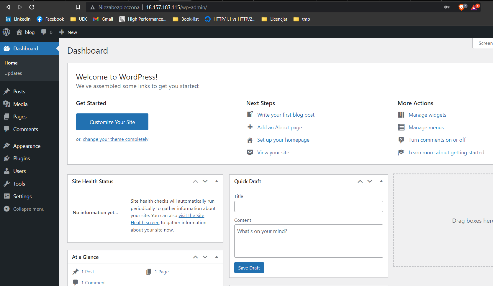
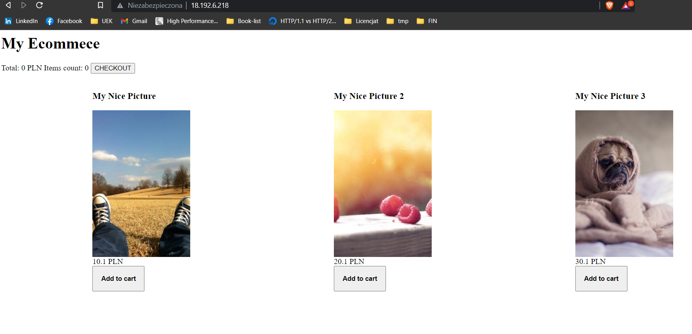

To run wordpress installation run
```
ansible-playbook -i hosts.ini setup_wp.yaml
```
Screenshot with working example


To run application with loadbalancer
```
ansible-playbook -i hosts.ini setup_ecommerce.yaml
```
Screenshot with working loadbalancer example
